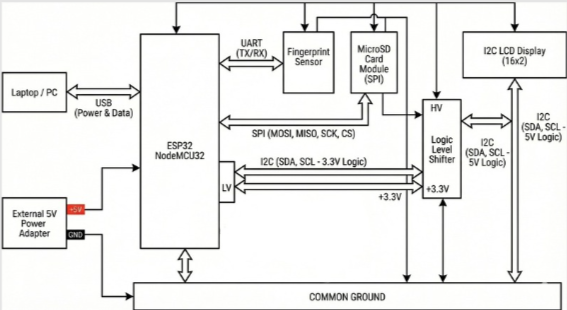
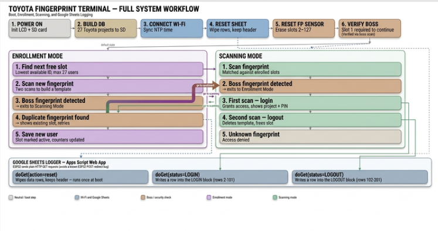
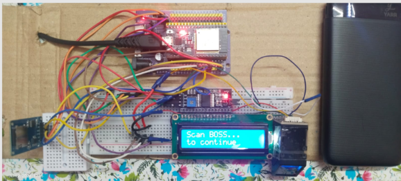
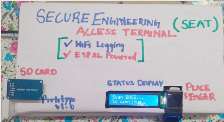

# Fingerprint-Based Secure SD Card Access System

An ESP32-powered biometric access control system utilizing optical fingerprint authentication, an SPI-based SD card database, and a 16x2 I2C LCD interface.

[Team](#team) • [Overview](#overview) • [Key Features](#key-features) • [Hardware Specifications](#hardware-specifications) • [Circuit & Pinout](#circuit-diagram--pinout) • [System Workflow](#system-workflow) • [Hardware Gallery](#hardware-gallery) • [Getting Started](#getting-started) • [Datasheets](#datasheets--documentation) • [Repository Structure](#repository-structure) • [Notes & Limitations](#notes--known-limitations) • [Future Work](#future-work)  • [License](#license)

---
## Team

* Aarif Mohammed Ali Sheik
* S Yogesh
* G K Pranav Sankar

## Overview

This project implements an administrator-controlled security system built on the ESP32 platform. Biometric authentication is managed via a two-tier hierarchy: an administrative fingerprint ("BOSS") controls system mode transitions, while standard user fingerprints map directly to indexed user data records stored in a MicroSD card database (`/database.txt`). System status, operational modes, and retrieved user data are rendered in real time on a 16x2 I2C LCD display.

---

## Key Features

* **Role-Based Access Control:** Slot 1 is reserved exclusively for the administrator ("BOSS") to toggle between Enrollment and Scanning modes.
* **Direct Database Mapping:** Biometric templates in slots 2+ map 1:1 to indexed text entries within the MicroSD card database file.
* **Real-Time Display Output:** Interfaced 16x2 I2C LCD provides immediate system state feedback and data retrieval displays.
* **Autonomous Database Initialization:** Generates database structures on bootup and validates module communication before operation.

---

## Hardware Specifications

| Component | Communication Interface | Description / Role |
| :--- | :---: | :--- |
| **ESP32 NodeMCU-32** | Main Controller | Manages system logic, SPI, I2C, and Hardware UART buses |
| **R307 / R307S Fingerprint Module** | UART (TX/RX) | Biometric template capture, storage, and matching |
| **MicroSD Card Module** | SPI | Hosts the central data registry (`/database.txt`) |
| **16x2 I2C LCD Display** | I2C (SDA/SCL) | Primary visual display interface |
| **Logic Level Shifter** | I2C Bridge | Converts ESP32 3.3V logic levels to 5V LCD logic levels |
| **External 5V Power Supply** | Power | Delivers stable power supply across all connected peripherals |

---

## Circuit Diagram & Pinout

| Circuit Diagram | ESP32 Pinout |
| :---: | :---: |
|  |  |

---

## System Workflow

### Operational Modes

1. **Initialization:** On bootup, the system verifies SD module readiness, clears volatile memory, and prompts for primary administrator enrollment into Slot 1.
2. **Enrollment Mode:** Scanning the administrator fingerprint switches the system into enrollment. New user fingerprints are registered sequentially starting at Slot 2.
3. **Scanning Mode:** Continuous background scanning. Scanning a registered user fetches and renders the corresponding line entry from the SD database onto the LCD display.

---

## Hardware Gallery

| System Assembly View 1 | System Assembly View 2 |
| :---: | :---: |
|  |  |

---

## Getting Started

### Prerequisites

* **Development Environment:** [Arduino IDE](https://www.arduino.cc/en/software) configured with ESP32 board support.
* **Required Libraries:**
  * `LiquidCrystal_I2C`
  * `SPI`
  * `SD`
  * `Adafruit_Fingerprint`
  * `HardwareSerial`

### Hardware Pinout Configuration

* **MicroSD Module CS:** `GPIO 5`
* **Fingerprint Sensor:** `UART2` (RX = `GPIO 16`, TX = `GPIO 17`) at `57600 baud`
* **I2C LCD Address:** `0x27`

### Setup and Upload Procedure

1. Clone or download this repository.
2. Open [`Final_Fingerprint.ino`](./Final_Fingerprint.ino) in Arduino IDE.
3. Select your ESP32 target board and corresponding serial port.
4. Compile and upload the sketch. View debug output via the Serial Monitor at `115200 baud`.

---

## Datasheets & Documentation

Hardware reference documentation included in this repository:

* **Microcontroller Datasheet:** [`esp32_datasheet_en.pdf`](./esp32_datasheet_en.pdf)
* **Fingerprint Sensor Datasheet:** [`R307.PDF`](./R307.PDF)

## Notes / Known Limitations

* On every reboot, `/database.txt` is fully overwritten and **all fingerprint templates are wiped**, requiring BOSS re-enrollment. This is by design for the current prototype and should be revisited before any persistent/production use.
* The database currently holds 20 fixed records (car models); Slot 1 is reserved for BOSS and never maps to a record.

## Future Work

* **Persistent storage:** Move away from wipe-on-boot behavior — persist fingerprint template metadata and the `nextID` counter in EEPROM/NVS (or a flag file on the SD card) so the system retains enrolled users across power cycles.
* **Real user records:** Replace the placeholder car-model database with actual user-relevant data (e.g., name, access level, timestamp log) mapped to each fingerprint slot.
* **Access logging:** Log every scan attempt (granted/denied/unknown) with a timestamp to the SD card for an auditable access history.
* **Fallback authentication:** Add a PIN/password fallback (e.g., via keypad) for cases where the fingerprint sensor fails to read.
* **Slot management:** Add a BOSS-only "delete user" flow so revoking access doesn't require a full system wipe.
* **Scalability:** Test and document behavior as the number of enrolled users approaches the sensor's template capacity.

## License

For academic/project use only. No formal license has been applied yet — contact the team before reuse or distribution.

